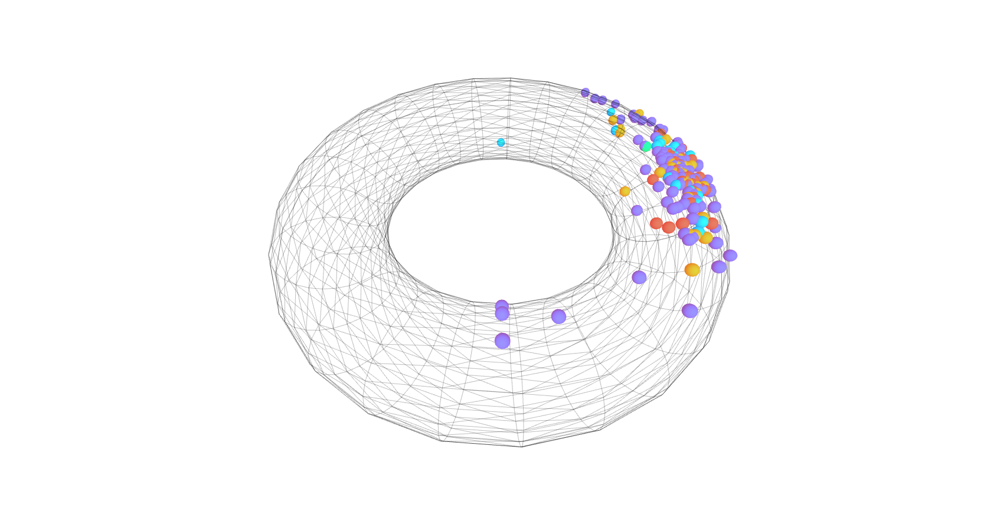

# Magnetic Graph Convolution Network v2


## About
The official PyTorch implementation for the paper *MGC: A Complex-Valued Graph Convolutional Network for Directed Graphs*.

## Requirements
To install requirements:
```console
pip3 install -r requirements.txt
```